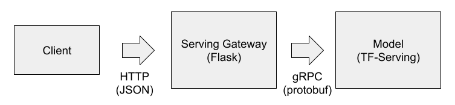

# Deploying Deep Learning models with Kubernetes (EKS)

In this tutorial, you’ll learn about

- Creating and configuring a EKS cluster
- Serving a Keras model with TF-Serving


## Installing Kubectl

[Instructions](https://kubernetes.io/docs/tasks/tools/install-kubectl/). Here’s a TLDR for Linux. For other OS, check the link.

Create a folder where you’ll keep it. For example, `~/bin`

Go there, download the kubectl binary:

```bash
curl -LO https://storage.googleapis.com/kubernetes-release/release/v1.20.0/bin/linux/amd64/kubectl
```

Make it executable:

```bash
chmod +x ./kubectl
```

Add this folder to `PATH`:

```bash
export PATH="~/bin:${PATH}"
```

Add this line to your `.bashrc`


## Install eksctl

Eksctl is a command line tool for creating and managing EKS clusters. [More info](https://docs.aws.amazon.com/eks/latest/userguide/eksctl.html)

Let’s install it to the same `~/.bin` directory where we installed
kubectl:


```bash
curl --silent --location "https://github.com/weaveworks/eksctl/releases/latest/download/eksctl\_$(uname-s)_amd64.tar.gz" | tar xz -C ~/bin/
```

## Create a EKS cluster

We’ll use eksctl for creating a cluster. [More info](https://docs.aws.amazon.com/eks/latest/userguide/getting-started-eksctl.html)


```bash
eksctl create cluster \
    --name ml-bookcamp-eks \
    --region eu-west-1
```

Note: if you want to use Fargate, check [this tutorial](https://www.learnaws.org/2019/12/16/running-eks-on-aws-fargate/).
Fargate might be better, but the setup process is more complex.

It should also create a config file in `~/.kube/config`. You should be
able to use kubectl now to connect to the cluster

Check that the config works:

```bash
kubectl get service
```

It should return the list of services currently running on a cluster:

```
NAME         TYPE        CLUSTER-IP   EXTERNAL-IP   PORT(S)   AGE
kubernetes   ClusterIP   10.100.0.1   <none>        443/TCP   6m17s
```

If you have an error like that:

```
[✖]  unable to use kubectl with the EKS cluster (check 'kubectl version'):
Unable to connect to the server: getting credentials: exec: fork/exec 
/usr/local/bin/aws-iam-authenticator: exec format error
```

You need to generate the config using aws cli ([Instruction](https://docs.aws.amazon.com/eks/latest/userguide/create-kubeconfig.html)).

This is how you do it:

```bash
aws eks --region eu-west-1 update-kubeconfig --name ml-bookcamp-eks
```

It will create a config located at `~/.kube/config`

Check that the config works:

```bash
kubectl get service
```

It should return the list of services currently running on a cluster:

```
NAME         TYPE        CLUSTER-IP   EXTERNAL-IP   PORT(S)   AGE
kubernetes   ClusterIP   10.100.0.1   <none>        443/TCP   6m17s
```


## Create a Docker registry

Next, we need to create a registry for our images. Let’s call it
“model-serving”:

```bash
aws ecr create-repository --repository-name model-serving
```

The response:

```json
{
    "repository": {
        "repositoryArn": "arn:aws:ecr:eu-west-1:XXXXXXXXXXXX:repository/model-serving",
        "registryId": "XXXXXXXXXXXX",
        "repositoryName": "model-serving",
        "repositoryUri": "XXXXXXXXXXXX.dkr.ecr.eu-west-1.amazonaws.com/model-serving",
        "createdAt": 1610664195.0,
        "imageTagMutability": "MUTABLE",
        "imageScanningConfiguration": {
            "scanOnPush": false
        },
        "encryptionConfiguration": {
            "encryptionType": "AES256"
        }
    }
}
```

We’ll need the url here: XXXXXXXXXXXX.dkr.ecr.eu-west-1.amazonaws.com/model-serving

“XXXXXXXXXXXX” is your account number.


## The architecture of the system



We will have two components:

  - Serving gateway — a Flask app that fetches images from the web and
    convert them in the right format
  - Model — the actual model served with TF-Serving

The components communicate with gRPC. The client talks to the gateway,
the gateway prepares the image, and TF-Serving applies the model to the
image.

The reasons we have two components:

  - TF-Serving is optimized for serving, but it’s a C++ code that you
    can’t include in your Flask app. It can’t easily fetch images from
    the web.
  - The model has a different workload (compute intensive), while the
    gateway is mostly doing IO work (fetching the images)
  - TF-Serving could run on a GPU, and it doesn’t make sense to do IO
    operations (getting the image). It will keep the GPU idle.


## Prepare the TF-Serving image

Now, download the model:

```bash
wget http://bit.ly/mlbookcamp-clothing-model
```

Convert it to the “saved_model” format. Put this to `convert.py`
script:

```python
import tensorflow as tf
from tensorflow import keras

model = keras.models.load_model('xception_v4_large_08_0.894.h5')

tf.saved_model.save(model, 'clothing-model')
```


And run it:

```bash
python convert.py
```

You should have a clothing-model folder with the model. We need to
inspect the model to know the names of the input and the output:

```bash
saved_model_cli show --dir clothing-model --all
```

The output should look like that:


```
MetaGraphDef with tag-set: 'serve' contains the following SignatureDefs:

signature_def['__saved_model_init_op']:
  The given SavedModel SignatureDef contains the following input(s):
  The given SavedModel SignatureDef contains the following output(s):
    outputs['__saved_model_init_op'] tensor_info:
        dtype: DT_INVALID
        shape: unknown_rank
        name: NoOp
  Method name is: 

signature_def['serving_default']:
  The given SavedModel SignatureDef contains the following input(s):
    inputs['input_8'] tensor_info: <=== INPUT
        dtype: DT_FLOAT
        shape: (-1, 299, 299, 3)
        name: serving_default_input_8:0
  The given SavedModel SignatureDef contains the following output(s):
    outputs['dense_7'] tensor_info: <=== OUTPUT
        dtype: DT_FLOAT
        shape: (-1, 10)
        name: StatefulPartitionedCall:0
  Method name is: tensorflow/serving/predict
```

  - > The name of the input is “input_8”
  - > The name of the output is “dense_7”


Now let’s prepare a TF-serving docker image. Let’s call it
`tf-serving.dockerfile`:

```docker
FROM tensorflow/serving:2.3.0

ENV MODEL_NAME clothing-model
COPY clothing-model /models/clothing-model/1
```


If you need GPU support, use `tensorflow/serving:2.3.0-gpu`

Build it:

```bash
IMAGE_SERVING_LOCAL="tf-serving-clothing-model"
docker build -t ${IMAGE_SERVING_LOCAL} -f tf-serving.dockerfile .
```

Tag it

```bash
ACCOUNT=XXXXXXXXXXXX
REGISTRY=${ACCOUNT}.dkr.ecr.eu-west-1.amazonaws.com/model-serving
IMAGE_SERVING_REMOTE=${REGISTRY}:${IMAGE_SERVING_LOCAL}
docker tag ${IMAGE_SERVING_LOCAL} ${IMAGE_SERVING_REMOTE}
```

Authenticate with AWS cli:

```bash
$(aws ecr get-login --no-include-email)
```

Push it to ECR:

```bash
docker push ${IMAGE_SERVING_REMOTE}
```


## Prepare the Serving Gateway image

Install dependencies:

```bash
pipenv install flask gunicorn \
    keras_image_helper==0.0.1 \
    grpcio==1.32.0 \
    tensorflow==2.3.0 \
    tensorflow-serving-api==2.3.0 
```


Note that installing TensorFlow is not necessary, but we use it for
simplicity — it has some protobuf files that we need for communication.
It’s possible to avoid this dependency. See [here](https://github.com/alexeygrigorev/tensorflow-protobuf)
for more details.

Code for communicating with the model deployed with TF-Serving. Let’s
call it `model_server.py`:

```python
import os

import grpc
import tensorflow as tf
from tensorflow_serving.apis import predict_pb2
from tensorflow_serving.apis import prediction_service_pb2_grpc

from keras_image_helper import create_preprocessor

from flask import Flask, request, jsonify


server = os.getenv('TF_SERVING_HOST', 'localhost:8500')

channel = grpc.insecure_channel(server)
stub = prediction_service_pb2_grpc.PredictionServiceStub(channel)

preprocessor = create_preprocessor('xception', target_size=(299, 299))


labels = [
    'dress',
    'hat',
    'longsleeve',
    'outwear',
    'pants',
    'shirt',
    'shoes',
    'shorts',
    'skirt',
    't-shirt'
]


def np_to_protobuf(data):
    return tf.make_tensor_proto(data, shape=data.shape)

def make_request(X):
    pb_request = predict_pb2.PredictRequest()
    pb_request.model_spec.name = 'clothing-model'
    pb_request.model_spec.signature_name = 'serving_default'
    # input_8 is the name of the output
    pb_request.inputs['input_8'].CopyFrom(np_to_protobuf(X))
    return pb_request


def process_response(pb_result):
    # dense_7 is the name of the input
    pred = pb_result.outputs['dense_7'].float_val
    result = {c: p for c, p in zip(labels, pred)}
    return result


def apply_model(url):
    X = preprocessor.from_url(url)
    pb_request = make_request(X)
    pb_result = stub.Predict(pb_request, timeout=20.0)
    return process_response(pb_result)


app = Flask('clothing-model')


@app.route('/predict', methods=['POST'])
def predict():
    url = request.get_json()
    result = apply_model(url['url'])
    return jsonify(result)


if __name__ == "__main__":
    app.run(debug=True, host='0.0.0.0', port=9696)
```


The docker file (`gateway.dockerfile`):

```docker
FROM python:3.7.5-slim

ENV PYTHONUNBUFFERED=TRUE

RUN pip --no-cache-dir install pipenv

WORKDIR /app

COPY ["Pipfile", "Pipfile.lock", "./"]
RUN pipenv install --deploy --system && \
    rm -rf /root/.cache

COPY "model_server.py" "model_server.py"

EXPOSE 9696

ENTRYPOINT ["gunicorn", "--bind", "0.0.0.0:9696", "model_server:app"]
```


Build the image:

```bash
IMAGE_GATEWAY_LOCAL="serving-gateway"
docker build -t ${IMAGE_GATEWAY_LOCAL} -f gateway.dockerfile .
```

Push to ECR:

```bash
IMAGE_GATEWAY_REMOTE=${REGISTRY}:${IMAGE_GATEWAY_LOCAL}
docker tag ${IMAGE_GATEWAY_LOCAL} ${IMAGE_GATEWAY_REMOTE}

docker push ${IMAGE_GATEWAY_REMOTE}
```

Done!

## Deploy the TF-Serving component

Now let’s prepare the deployment config. Let’s call it
`tf-serving-clothing-model-deployment.yaml`:

```yaml
apiVersion: apps/v1
kind: Deployment
metadata:
  name: tf-serving-clothing-model
  labels:
    app: tf-serving-clothing-model
spec:
  replicas: 1
  selector:
    matchLabels:
      app: tf-serving-clothing-model
  template:
    metadata:
      labels:
        app: tf-serving-clothing-model
    spec:
      containers:
      - name: tf-serving-clothing-model
        image: XXXXXXXXXXXX.dkr.ecr.eu-west-1.amazonaws.com/model-serving:tf-serving-clothing-model
        ports:
          - containerPort: 8500
```

Here, we use the image from `${IMAGE_SERVING_REMOTE}` (Don’t forget to
replace XXXXXXXXXXXX by your account number)

Apply it:

```bash
kubectl apply -f tf-serving-clothing-model-deployment.yaml
```
Check that it’s working

```bash
kubectl get pod
```
You should see that

```
NAME                                         READY   STATUS    RESTARTS   AGE
tf-serving-clothing-model-6b5ff86f77-dlsdc   1/1     Running   0          86s
```


If you see that it’s pending, give it some time (1-2 minutes).
Kebernetes needs to allocate some nodes first, so the service can work.

Now create a config for the service. Let’s call it
`tf-serving-clothing-model-service.yaml`:


```yaml
apiVersion: v1
kind: Service
metadata:
  name: tf-serving-clothing-model
  labels:
    app: tf-serving-clothing-model
spec:
  ports:
    - port: 8500
      targetPort: 8500
      protocol: TCP
      name: http
  selector:
    app: tf-serving-clothing-model
```


Apply

```bash
kubectl apply -f tf-serving-clothing-model-service.yaml
```

Let’s check that it works

```bash
kubectl get services
```

We should see something like that

```
NAME                        TYPE        CLUSTER-IP       EXTERNAL-IP   PORT(S)    AGE
kubernetes                  ClusterIP   10.100.0.1       <none>        443/TCP    84m
tf-serving-clothing-model   ClusterIP   10.100.111.165   <none>        8500/TCP   19s
```

The url that we can use to access this service internally looks like
that

`<service-name>.<namespace-name>.svc.cluster.local`

For us, the namespace is “default” and the service name is
“tf-serving-clothing-model”, so the full URL should be

`tf-serving-clothing-model.default.svc.cluster.local`

We’ll need it later.

## Deploy the Serving Gateway component

Now let’s create a config for deploying the gateway. We’ll call it
`serving-gateway-deployment.yaml`:


```yaml
apiVersion: apps/v1
kind: Deployment
metadata:
  name: serving-gateway
  labels:
    app: serving-gateway
spec:
  replicas: 1
  selector:
    matchLabels:
      app: serving-gateway
  template:
    metadata:
      labels:
        app: serving-gateway
    spec:
      containers:
      - name: serving-gateway
        image: XXXXXXXXXXXX.dkr.ecr.eu-west-1.amazonaws.com/model-serving:serving-gateway
        ports:
          - containerPort: 9696
        env:
          - name: TF_SERVING_HOST
            value: "tf-serving-clothing-model.default.svc.cluster.local:8500"
```


Don’t forget to replace `XXXXXXXXXXXX` by your account number.

Let’s apply it:

```bash
kubectl apply -f serving-gateway-deployment.yaml
```

Check:

```bash
kubectl get pod
```

It should print something like that:

```
NAME                                         READY   STATUS    RESTARTS   AGE
serving-gateway-58b5cb4578-rj6j2             1/1     Running   0          22m
tf-serving-clothing-model-6b5ff86f77-dlsdc   1/1     Running   0          31m
```

You might need to give it 1-2 minutes: it needs to download the image
from ECR for the first run.

Now we can do a quick check. Connect to this pod and see if our system
works. We can do it with port-forwarding:

```bash
kubectl port-forward serving-gateway-58b5cb4578-rj6j2 9696:9696
```

Let’s test it. Create a file `test.py`:


```python
import requests

req = {
    "url": "http://bit.ly/mlbookcamp-pants"
}

url = 'http://localhost:9696/predict'

response = requests.post(url, json=req)
print(response.json())
```

We will use this picture for testing:


So let’s run the script:

```bash
python test.py
```

It should print the predictions:

```python
{'dress': -1.868, 'hat': -4.761, 'longsleeve': -2.316, 'outwear':
-1.062, 'pants': 9.887, 'shirt': -2.812, 'shoes': -3.666, 'shorts':
3.200, 'skirt': -2.602, 't-shirt': -4.835}
```

We see that the score for pants is the highest. So it must be a picture
of pants.

Now let’s create a config for the service. We can call it
`serving-gateway-service.yaml`:


```yaml
apiVersion: v1
kind: Service
metadata:
  name: serving-gateway
  labels:
    app: serving-gateway
spec:
  type: LoadBalancer
  ports:
    - port: 80
      targetPort: 9696
      protocol: TCP
      name: http
  selector:
    app: serving-gateway
```


Note that the type is “LoadBalancer”. For this type of service, EKS will
create a [classic load balancer](https://docs.aws.amazon.com/elasticloadbalancing/latest/classic/introduction.html)
on AWS.

Let’s apply this config:

```bash
kubectl apply -f serving-gateway-service.yaml
```

To see the URL of the service, use `describe`:

```bash
kubectl describe service serving-gateway
```

It should output some results:


```
Name:                     serving-gateway
Namespace:                default
Labels:                   <none>
Annotations:              <none>
Selector:                 app=serving-gateway
Type:                     LoadBalancer
IP Families:              <none>
IP:                       10.100.100.24
IPs:                      <none>
LoadBalancer Ingress:     ad1fad0c1302141989ed8ee449332e39-117019527.eu-west-1.elb.amazonaws.com
Port:                     http  80/TCP
TargetPort:               9696/TCP
NodePort:                 http  32196/TCP
Endpoints:                <none>
Session Affinity:         None
External Traffic Policy:  Cluster
Events:
  Type    Reason                Age   From                Message
  ----    ------                ----  ----                -------
  Normal  EnsuringLoadBalancer  4s    service-controller  Ensuring load balancer
  Normal  EnsuredLoadBalancer   2s    service-controller  Ensured load balancer
```


We’re interested in “LoadBalancer Ingress”. This is the URL we’ll need
to use:

ad1fad0c1302141989ed8ee449332e39-117019527.eu-west-1.elb.amazonaws.com

Now let’s update our `test.py` script:

```python
import requests

req = {
    "url": "http://bit.ly/mlbookcamp-pants"
}

url = 'http://ad1fad0c1302141989ed8ee449332e39-117019527.eu-west-1.elb.amazonaws.com/predict'

response = requests.post(url, json=req)
print(response.json())
```

And run it:

python test.py

It works!

```python
{'dress': -1.868, 'hat': -4.761, 'longsleeve': -2.316, 'outwear':
-1.062, 'pants': 9.887, 'shirt': -2.812, 'shoes': -3.666, 'shorts':
3.200, 'skirt': -2.602, 't-shirt': -4.835}
```

If you see “Remote end closed connection without response”, wait a bit.
The load balancer needs a bit of time to start.


## Deleting the cluster

Use eksctl for that:

```bash
eksctl delete cluster --name ml-bookcamp-eks
```
